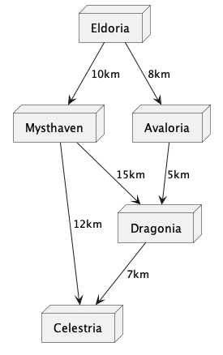

# Kürzester Pfad

## Das Problem
Problem des kürzesten Weges, „shortest-path-Problem“ oder kurz SP-Problem, besteht darin, in einem zusammenhängenden und
bewerteten Graphen zwischen zwei verschiedenen Ecken einen kürzesten Weg aufzuspüren.

## Grundlagen
- Ein Graph G besteht aus einer Menge von Knoten V und einer Menge von Kanten oder Pfeilen.
- Wenn das Knotenpaar ungeordnet ist (d.h., die Kante hat keine Richtung), wird G als ungerichteter Graph bezeichnet, und 
die Elemente in der Menge E werden als Kanten bezeichnet. Diese Kanten können als {i, j} dargestellt werden. Wenn jedem 
Element in E ein geordnetes Knotenpaar zugewiesen ist, wird G als gerichteter Graph bezeichnet. Die Elemente in E werden
dann als Pfeile bezeichnet und mit (i, j) dargestellt.
- Ein Graph G wird als bewerteter Graph bezeichnet, wenn alle seine Pfeile (i, j) oder Kanten {i, j} mit einer 
Bewertung cij versehen sind. Diese Bewertung c kann beispielsweise die Transportkosten von i nach j, die Länge 
der Verbindung oder eine Fahrzeit repräsentieren. Wenn ein Weg w = (jo, ..., jt) ausgewählt wird, bezeichnet man die
Summe aller Kosten entlang dieses Weges als die Länge des Weges. Ein Weg wird als der kürzeste Weg von i nach j 
bezeichnet, wenn die Kosten für diesen Weg minimal sind.

## Anwendungsbezogenes Beispiel
Gegeben sei ein fiktionaler Staat mit den Städten Eldoria, Mysthaven, Avaloria, Dragonia und Celestria. Ein Kaufmann
möchte nun von Eldoria nach Celestria reisen und dabei den kürzesten Weg gehen.

### Graphentheoretisches Modell 
Um das Problem lösen zu können, müssen wir als ersten Schritt ein graphentheoretisches Modell aufstellen, das unser
Problem modelliert.

Die Städte sind unsere Knoten und die Straßenverbindungen zwischen den Städten entsprechen unseren Kanten. Da dem
Kaufmann die Entfernungen bekannt sind, sprechen wir von bewerteten Kanten.

